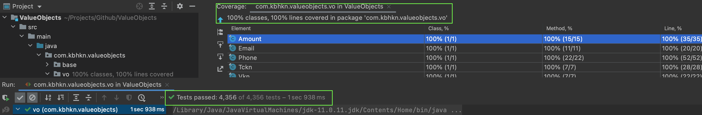

## Common Value Objects

I wrote 5 value objects for the validation.

- Amount.
- Email
- Phone
- Tckn
- Vkn

Passed **4356** test cases and coverage is **%100.**
> Open test/resources/coverage_results/index.html to access the report.
  
